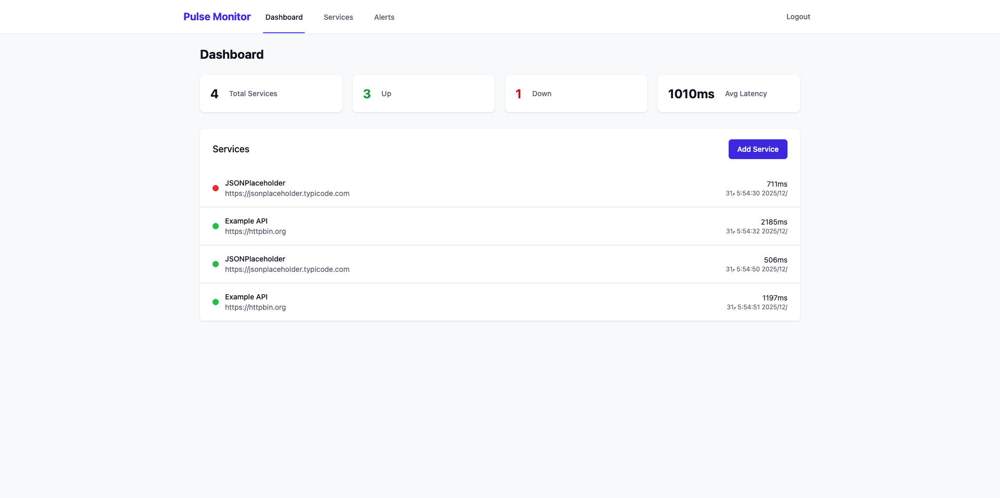
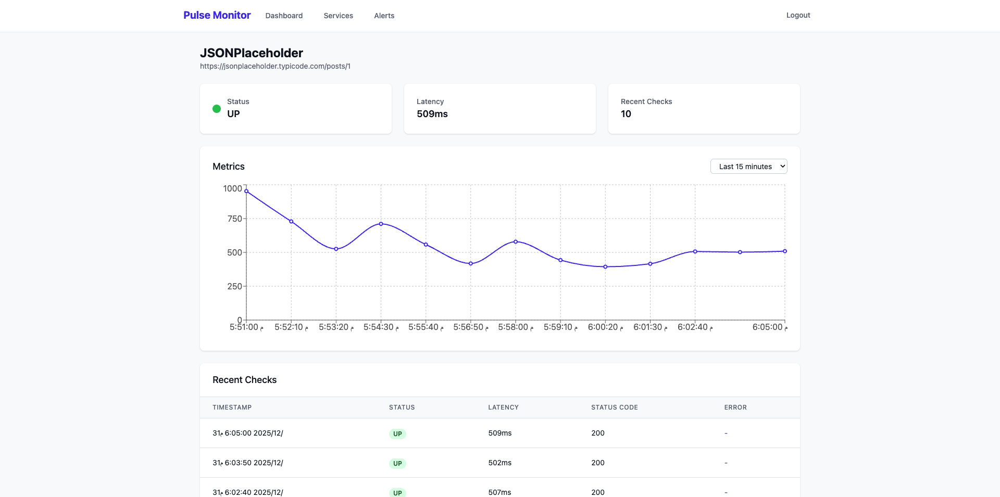
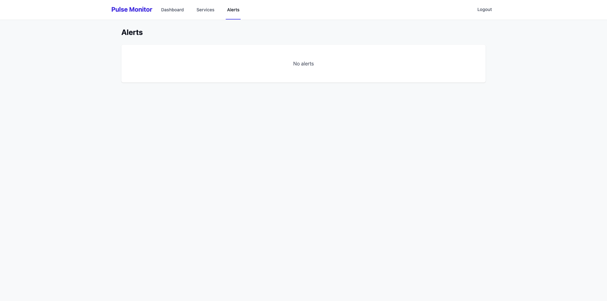
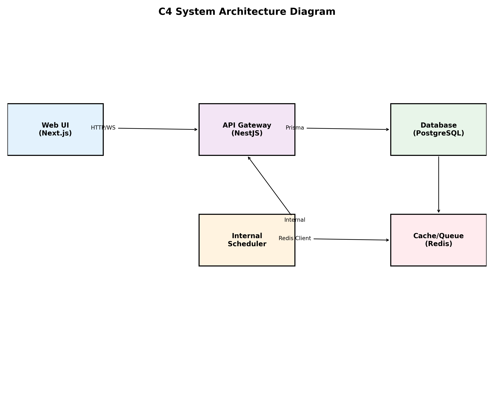
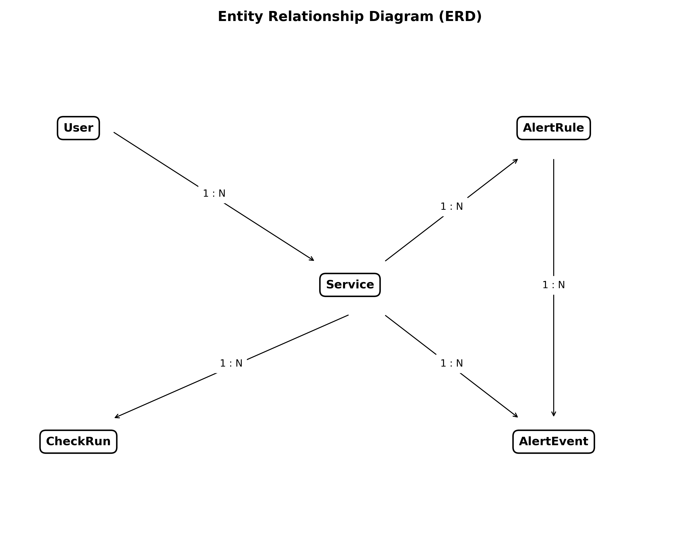

# Pulse Monitor

Pulse Monitor is a professional full-stack platform designed for real-time monitoring of API services. It provides automated health checks, performance metrics visualization, and consecutive failure alerting through a modern dashboard.

## Visual Interface & Gallery

### 1. Main Dashboard
Provides a real-time aggregate view of all monitored services, showing system-wide health status and average latency metrics at a glance.


### 2. Service Management
A comprehensive interface for adding, configuring, and managing external API endpoints with customizable monitoring parameters.


### 3. Analytical Metrics & Service Details
Deep-dive analytics for individual services, featuring interactive charts that visualize latency trends, status history, and operational performance over time.


### 4. Incident Monitoring & Alerts
A detailed event log capturing automated alert triggers when services exceed consecutive failure thresholds, ensuring rapid incident response and system reliability.


## System Architecture

The project is built using a Monorepo architecture to ensure clean code sharing and consistent versioning across the stack.

### C4 System Architecture
The following diagram illustrates the high-level system components and their interactions, ranging from the client-side UI to the internal scheduling engine and persistent storage layers.


### Entity Relationship Diagram (ERD)
The database schema is optimized for performance and historical data tracking, maintaining integrity between user accounts, service configurations, and millions of check results.


## Tech Stack

### Core Infrastructure
- **Monorepo Management**: TurboRepo
- **Runtime**: Node.js 20+
- **Containerization**: Docker & Docker Compose

### Backend (apps/api)
- **Framework**: NestJS (TypeScript)
- **Database**: PostgreSQL with Prisma ORM
- **Security**: JWT (Access & Refresh tokens), Helmet, Rate Limiting, Bcrypt
- **Real-time**: Socket.IO for live dashboard updates
- **Scheduling**: @nestjs/schedule for automated periodic health checks

### Frontend (apps/web)
- **Framework**: Next.js 14 (App Router)
- **Styling**: Tailwind CSS
- **Visualization**: Recharts for latency and performance metrics
- **Communication**: Socket.IO Client for real-time state synchronization

### Shared (packages/shared)
- **Validation**: Zod schemas for cross-stack type safety
- **Types**: Shared TypeScript interfaces and enums

## Core Features

- **Automated Monitoring**: Configurable health check intervals and timeout settings per service.
- **Real-time Dashboard**: Live updates on service status and latency without page refreshes.
- **Secure Authentication**: Robust JWT implementation with hashed refresh token rotation.
- **Alerting System**: Automated alerts triggered by consecutive failure thresholds.
- **Metric History**: Detailed history of check runs with status codes and latency tracking.

## Getting Started

### Prerequisites
- Docker and Docker Compose
- Node.js 20+ (for local development)

### Quick Start with Docker

```bash
# 1. Start all services (Database, Redis, API, and Web)
docker compose up -d --build

# 2. Run database migrations and seed initial data
docker compose exec api npx prisma migrate deploy
docker compose exec api npm run prisma:seed
```

The application will be accessible at:
- **Web UI**: http://localhost:3000
- **API Server**: http://localhost:4000/api

### Default Credentials
- **Email**: admin@pulse-monitor.com
- **Password**: admin123

## API Documentation

### Authentication
- `POST /api/auth/login` - Secure login
- `POST /api/auth/refresh` - Token rotation
- `POST /api/auth/logout` - Session termination

### Service Management
- `GET /api/services` - List all monitored services
- `POST /api/services` - Register a new service
- `GET /api/services/:id` - Retrieve detailed service configuration
- `PATCH /api/services/:id` - Update service settings
- `DELETE /api/services/:id` - Remove service

---
**Developed by Abdullah Hafiz Al-Amrani**  
[s6.sa](https://s6.sa)
